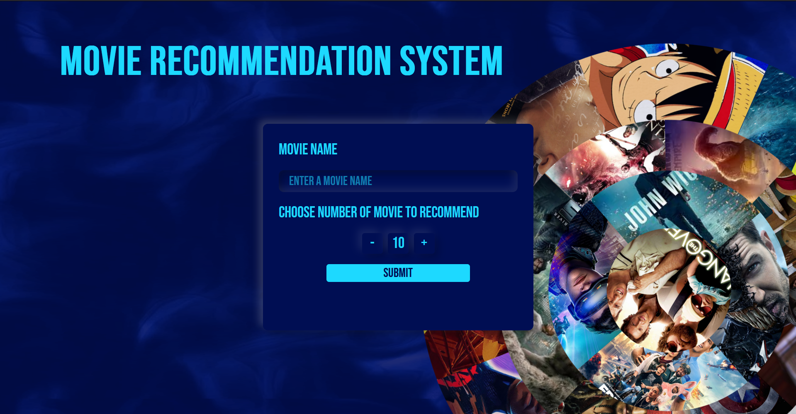
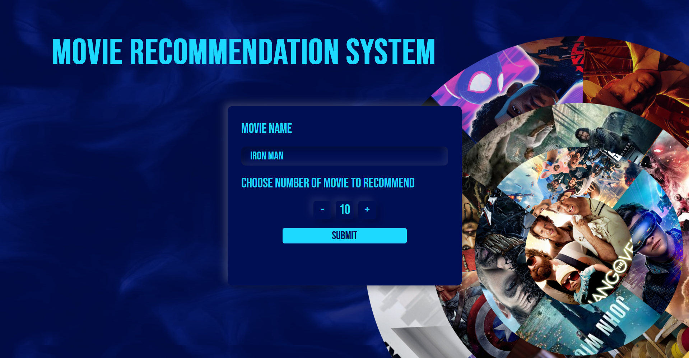
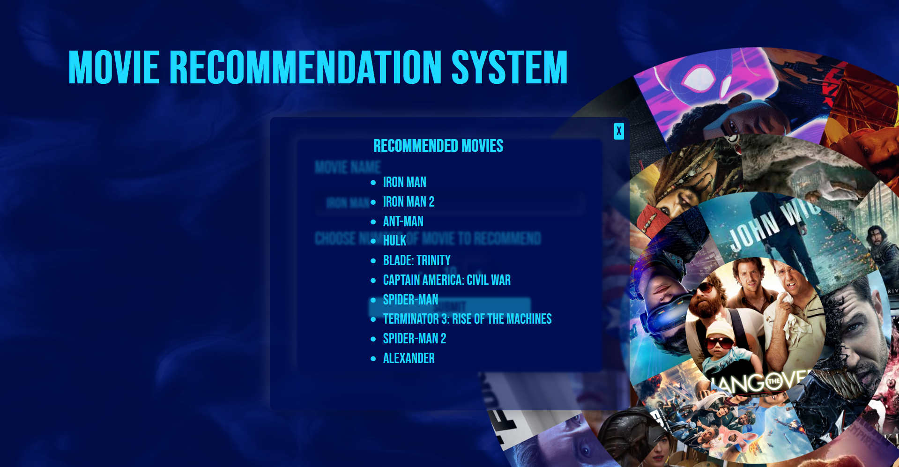

# MOVIE RECOMMENDATION SYSTEM

With a wide range of movie list and enhanced way of using filtering this project is developed to recommend the top related movies with the required number of movies as per the user's customization and with a better UI

### INSTALLATION

```
> git clone

> cd movie-recommendation-system

> python -m pip install -r requirements.txt

```

### Execution

Run the application by double clicking the 'run.bat' file

or

> python app.py

### Tech Stack and Tools used

-   Python 3.12
-   HTML5
-   CSS 3
-   JS
-   Figma (design)
-   Postman testing
-   VS Code
-   Jupyter note book

### Specifications

-   OS : Windows
-   Python version: > 3.10
-   Browser : Firefox / Chrome / Brave / Opera
-   Resolution : 1920 x 1080 / 1920 x 1200
-   Zoom level : 100%

### Screen shots

Explore our UI



Search your movies



See the matching ones



## Contact

<style>
    .cards{
        width: 100%;
        display:flex;
        justify-content: space-evenly;
    }
    .card{
        height:200px;
        width:44%;
        background:#ffc8dd;
        border-radius: 5px;
        padding:2%;
        color: #8338ec;
    }
    .card a{
        text-decoration:none;
        color:#3a86ff
    }
    .images{
        width:300px
    }
    .images a img{
        width:50px;
        aspect-ratio:1/1;
    }

</style>
<div class="cards">
    <div class="card">
        <h3>Varun S</h3>
        <h5>Backend(Flask) and Machine learning</h5>
        <hr style="background-color:#3a86ff; height:2px;"/>
        <div class='images'>
            <a href="mailto:varunsivakumar2002@gmail.com"></a>
            <a href="https://www.linkedin.com/in/varun-s-132197210/" ></a>
            <a href="https://github.com/VarunS21"></a>
        </div>
    </div>
    <div class="card">
        <h3>Athidya U</h3>
        <h5>Front end and designing</h5>
        <hr style="background-color:#3a86ff; height:2px;"/>
        <div class='images'>
            <a href="mailto:athidya23.03.2003@gmail.com"></a>
            <a href="https://www.linkedin.com/in/athidya-udayakumar-103506213?utm_source=share&utm_campaign=share_via&utm_content=profile&utm_medium=android_app"></a>
            <a href="https://github.com/M3PH1ST023"></a>
        </div>
    </div>
</div>
